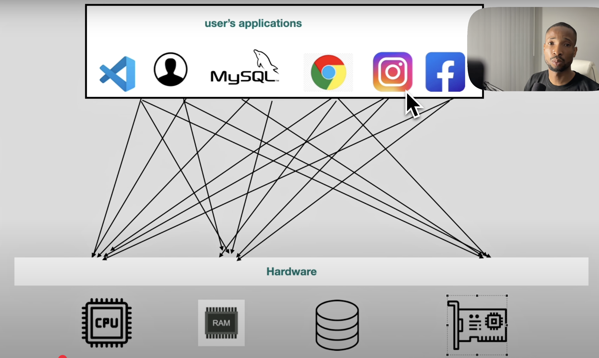
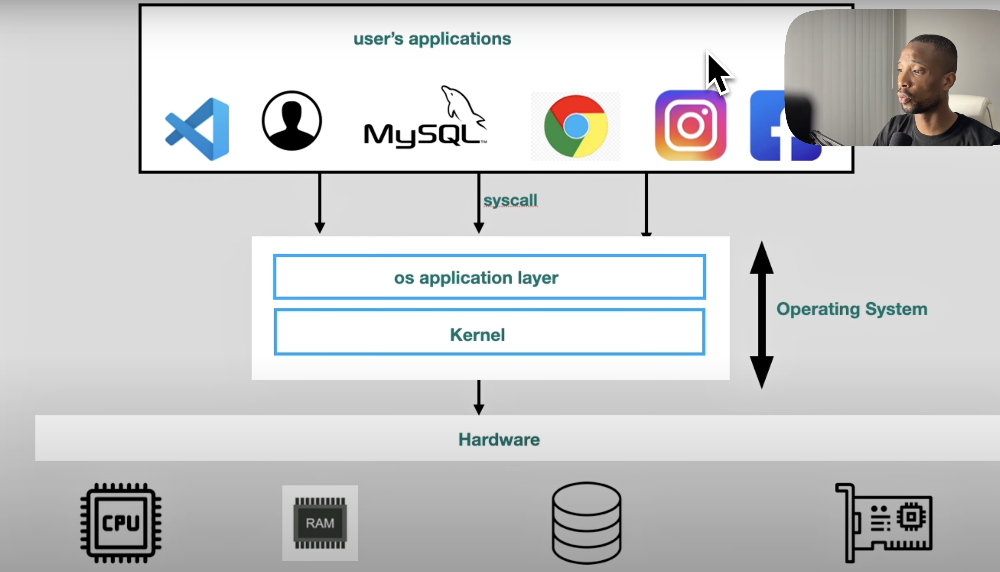

# The Computer

## Hardware Components

Computers are electronic devices that process data and perform tasks according to a set of instructions called programs. They consist of various hardware components that work together to execute these tasks. The main hardware components of a computer include:

1. **Central Processing Unit (CPU)** - The CPU is the brain of the computer, responsible for executing instructions and performing calculations. It consists of the control unit, arithmetic logic unit (ALU), and registers.

2. **Memory (RAM)** - Random Access Memory (RAM) is a type of volatile memory that temporarily stores data and instructions that the CPU needs while performing tasks. It allows for quick access to frequently used information.

3. **Storage** - Storage devices, such as hard disk drives (HDD) and solid-state drives (SSD), provide long-term storage for data and programs. They retain information even when the computer is powered off.

4. **Motherboard** - The motherboard is the main circuit board that connects all the hardware components of the computer. It provides communication pathways between the CPU, memory, storage, and peripheral devices.

5. **Input Devices** - Input devices, such as keyboards, mice, and scanners, allow users to interact with the computer and provide data for processing.

## Software Components

Software refers to the programs and operating systems that run on a computer, enabling it to perform specific tasks. There are two main types of software: system software and application software.

## How It Was Before the Operating System

Before the advent of operating systems, computers were operated using machine language or assembly language, which are low-level programming languages that are difficult for humans to read and write. Users had to interact directly with the hardware, which required a deep understanding of the computer's architecture and operation.

This made it challenging for non-experts to use computers effectively. Additionally, early computers lacked multitasking capabilities, meaning they could only run one program at a time. This limited their usability and efficiency.

## The Operating System

An operating system (OS) is system software that manages computer hardware, software resources, and provides common services for computer programs. It acts as an intermediary between users and the computer hardware, enabling efficient execution of applications.

### Key Functions of an Operating System

1. **Process Management** - The OS manages the creation, scheduling, and termination of processes. It allocates CPU time to various processes and ensures that they do not interfere with each other.

2. **Memory Management** - The OS handles the allocation and deallocation of memory space to various applications. It ensures that each application has enough memory to function properly while preventing memory leaks and fragmentation.

3. **File System Management** - The OS manages files on storage devices, providing a hierarchical structure for organizing and accessing files. It handles file creation, deletion, reading, writing, and permissions.

4. **Device Management** - The OS manages hardware devices such as printers, disk drives, and network interfaces. It provides a standardized interface for applications to interact with hardware components.

5. **Security and Access Control** - The OS implements security measures to protect data and resources from unauthorized access. It manages user authentication, permissions, and encryption.

6. **User Interface** - The OS provides a user interface (UI), such as command-line interfaces (CLI) or graphical user interfaces (GUI), that allows users to interact with the computer system.

## Benefits of Operating Systems

Operating systems transformed computing by providing:

- **Abstraction** - Users no longer need to understand hardware details
- **Multitasking** - Multiple programs can run simultaneously
- **Resource Management** - Efficient allocation of CPU, memory, and storage
- **Security** - Protection of data and system resources
- **User-Friendly Interfaces** - Making computers accessible to everyone
- **Device Independence** - Applications work across different hardware configurations

